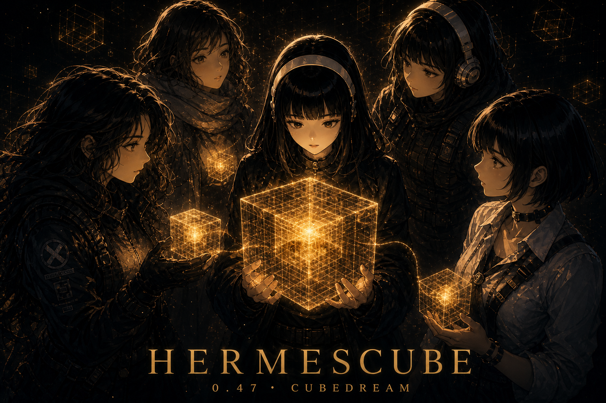

<p align="center">
  
</p>

# HermesCube

<p align="center">
  <em>The library under Hermes — long memory as a book of chapters, offline, under your home.</em>
</p>

<p align="center">
  <a href="ABOUT.md"></a>
  <a href="https://github.com/PabloTheThinker/hermescube/actions/workflows/ci.yml"></a>
  
  <a href="LICENSE"></a>
  
</p>

**HermesCube is the core deep-memory of a Hermes base** — a local **library** that keeps years of agent life and compresses it into **chapters (arcs)**, not a second chatbot and not a cloud memory SaaS.

Hermes Agent is the librarian on duty (tools, chat, skills).  
**HermesCube is the stacks.** Hot `MEMORY.md` is the desk card catalog. The bound volume is `$HERMES_HOME/memories/memory.cube`.

| Library idea | In the product |
|--------------|----------------|
| **Book** | one `memory.cube` per Hermes home / profile |
| **Chapter / arc** | crystals, growth eras, dream consolidations, project spines |
| **Page** | a landmark, belief, trait, or relationship entry |
| **Card catalog** | hot MEMORY.md + journey |
| **Heart / provenance** | [blackbox](docs/BLACKBOX.md) flight records — prove work was done |
| **Inter-library loan** | optional Hive (multi-agent), not required day one |

No cloud memory APIs. Your data stays under `$HERMES_HOME/memories/`. Updates never wipe the book.

<table>
<tr><td><b>Works with Hermes, not instead of it</b></td><td>Hot MEMORY.md stays always-on. Cube is the long library Hermes loads through <code>memory.provider</code>.</td></tr>
<tr><td><b>Semantic shelves, local</b></td><td>HAR + learned embeddings + entity graphs — meaning over grepping CCTV logs. No embedding SaaS.</td></tr>
<tr><td><b>Compress over years</b></td><td>Append pages, then bind chapters (crystalize, merge, dream). Context windows are not the archive.</td></tr>
<tr><td><b>Prove, don’t vibe</b></td><td><a href="docs/BLACKBOX.md">Blackbox</a> captures redacted trajectories and proves claims (“tests pass”) against evidence.</td></tr>
<tr><td><b>Heart for Hermespace</b></td><td><a href="docs/HERMESPACE.md">Heart</a> + <a href="docs/ANATOMY.md">center</a> — Cube generates FOA blood; Space focuses the turn.</td></tr>
<tr><td><b>Solo library first</b></td><td>Hive / HQ / dream-circles are inter-library loan. Open the building before the consortium.</td></tr>
</table>

Pitch: **[ABOUT.md](ABOUT.md)**. North star: **[PURPOSE.md](PURPOSE.md)**. Full map: **[docs/ARCHITECTURE.md](docs/ARCHITECTURE.md)**.

---

## Install into Hermes Agent

```bash
# Option A — Hermes plugin installer (recommended)
hermes plugins install PabloTheThinker/hermescube
cd "${HERMES_HOME:-$HOME/.hermes}/plugins/hermescube"
./scripts/install_hermes.sh
hermes config set memory.provider hermescube

# Option B — clone then install
git clone https://github.com/PabloTheThinker/hermescube.git
cd hermescube
./scripts/install_hermes.sh
hermes config set memory.provider hermescube
```

**Day-one library open:**

```bash
hermescube doctor
hermes memory status
hermescube query "what do we know about…"
hermescube blackbox capture --latest
hermescube blackbox prove --claim "tests pass" --latest
```

| Path | Who owns it |
|------|-------------|
| `$HERMES_HOME/plugins/hermescube/` | Plugin code |
| `$HERMES_HOME/memories/memory.cube` | **Your** book |
| `$HERMES_HOME/config.yaml` | `memory.provider: hermescube` |

### Update

```bash
hermescube update
```

`hermes update` updates Hermes Agent only. Cube is a plugin. **The book is never overwritten by update.**

---

## Getting started

```bash
hermescube doctor                 # is the library healthy?
hermescube info                   # volume stats
hermescube query "…"              # find passages by meaning
hermescube blackbox capture --latest
hermescube blackbox prove --claim "tests pass" --latest
hermescube blackbox breathe --latest   # advanced: prove + seal + relations
hermescube dream status           # chapter-binding night cycle
hermescube dense                  # portable text backup (vectors stay local)
```

Agent tools (when provider is on):

| Tool | Purpose |
|------|---------|
| `hermescube_search` | Find passages in the book |
| `hermescube_manage` | Warehouse · Cuboasis · growth · fleet · dream |
| `hermescube_feedback` | Mark recalls helpful / unhelpful |
| `hermescube_probe` | Entity focus / diagnostics |

---

## Documentation

| Doc | Read when |
|-----|-----------|
| [ABOUT.md](ABOUT.md) | Library metaphor + what/why |
| [PURPOSE.md](PURPOSE.md) | North star (Hermes-base core) |
| [docs/ARCHITECTURE.md](docs/ARCHITECTURE.md) | Full blueprint |
| [docs/BLACKBOX.md](docs/BLACKBOX.md) | Flight recorder / prove |
| [docs/HERMESPACE.md](docs/HERMESPACE.md) | Heart ↔ desk |
| [docs/ANATOMY.md](docs/ANATOMY.md) | Center organs (incl. blackbox) |
| [docs/README.md](docs/README.md) | Full index |

---

## Community pitch (one line)

**HermesCube is the library under Hermes: a local book of long memory that compresses life into chapters, with a heart that can prove what was actually done.**

Day-one surface: **remember · prove · doctor**. Advanced organs stay documented, not forced.

---

## License

MIT — [LICENSE](LICENSE)  
**Home:** https://github.com/PabloTheThinker/hermescube
